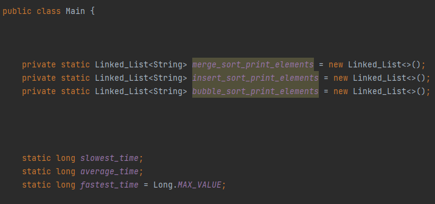
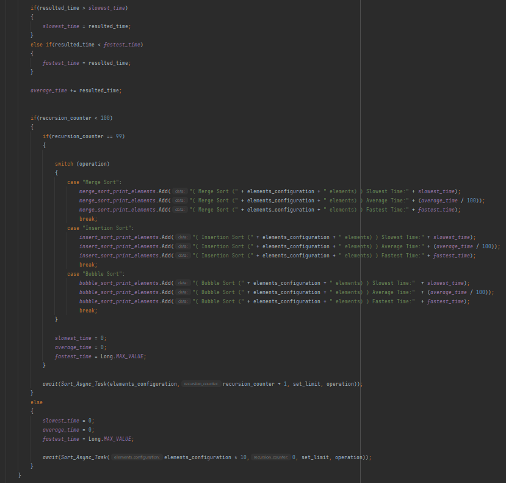
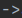
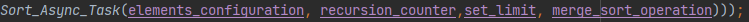

Table of contents:

Table of contents:
\...\...\...\...\...\...\...\...\...\...\...\...\...\...\...\...\...\...\...\...\...\...\...\...\...\...\...\...\...\...\...\...\...\...\...\...\...\...\...\...\...\...\...\...\...\...\...\...\...\...\...\.....
2

Task 1
\...\...\...\...\...\...\...\...\...\...\...\...\...\...\...\...\...\...\...\...\...\...\...\...\...\...\...\...\...\...\...\...\...\...\...\...\...\...\...\...\...\...\...\...\...\...\...\...\...\...\...\...\...\...\...\...\...\...\...
3

> Algorithms and specifications
> \...\...\...\...\...\...\...\...\...\...\...\...\...\...\...\...\...\...\...\...\...\...\...\...\...\...\...\...\...\...\...\...\...\...\...\...\...\...\...\...\...\...\...\...\....
> 3
>
> Merge Sort
> \...\...\...\...\...\...\...\...\...\...\...\...\...\...\...\...\...\...\...\...\...\...\...\...\...\...\...\...\...\...\...\...\...\...\...\...\...\...\...\...\...\...\...\...\...\...\...\...\...\...\...\...\.....
> 3
>
> Merge sort way of operation
> \...\...\...\...\...\...\...\...\...\...\...\...\...\...\...\...\...\...\...\...\...\...\...\...\...\...\...\...\...\...\...\...\...\...\...\...\...\...\...\...\...\...\...
> 4
>
> Merge Sort Advantages
> \...\...\...\...\...\...\...\...\...\...\...\...\...\...\...\...\...\...\...\...\...\...\...\...\...\...\...\...\...\...\...\...\...\...\...\...\...\...\...\...\...\...\...\...\.....
> 5
>
> Merge Sort Disadvantages
> \...\...\...\...\...\...\...\...\...\...\...\...\...\...\...\...\...\...\...\...\...\...\...\...\...\...\...\...\...\...\...\...\...\...\...\...\...\...\...\...\...\...\...\....
> 5
>
> Merge sort implementation within the program
> \...\...\...\...\...\...\...\...\...\...\...\...\...\...\...\...\...\...\...\...\...\...\...\...\...\...\...\...\...\...\...\.....
> 6
>
> Bubble Sort
> \...\...\...\...\...\...\...\...\...\...\...\...\...\...\...\...\...\...\...\...\...\...\...\...\...\...\...\...\...\...\...\...\...\...\...\...\...\...\...\...\...\...\...\...\...\...\...\...\...\...\...\...\....
> 7
>
> Bubble Sort way of operation
> \...\...\...\...\...\...\...\...\...\...\...\...\...\...\...\...\...\...\...\...\...\...\...\...\...\...\...\...\...\...\...\...\...\...\...\...\...\...\...\...\...\.....
> 8
>
> Bubble Sort Advantages
> \...\...\...\...\...\...\...\...\...\...\...\...\...\...\...\...\...\...\...\...\...\...\...\...\...\...\...\...\...\...\...\...\...\...\...\...\...\...\...\...\...\...\...\...\...
> 10
>
> Bubble Sort Disadvantages
> \...\...\...\...\...\...\...\...\...\...\...\...\...\...\...\...\...\...\...\...\...\...\...\...\...\...\...\...\...\...\...\...\...\...\...\...\...\...\...\...\...\...\....
> 10
>
> Bubble sort implementation within the program
> \...\...\...\...\...\...\...\...\...\...\...\...\...\...\...\...\...\...\...\...\...\...\...\...\...\...\...\...\...\...\.....
> 11
>
> Insertion Sort
> \...\...\...\...\...\...\...\...\...\...\...\...\...\...\...\...\...\...\...\...\...\...\...\...\...\...\...\...\...\...\...\...\...\...\...\...\...\...\...\...\...\...\...\...\...\...\...\...\...\...\.....
> 11
>
> Insertion sort way of operation
> \...\...\...\...\...\...\...\...\...\...\...\...\...\...\...\...\...\...\...\...\...\...\...\...\...\...\...\...\...\...\...\...\...\...\...\...\...\...\...\...\...
> 12
>
> Insertion sort advantages
> \...\...\...\...\...\...\...\...\...\...\...\...\...\...\...\...\...\...\...\...\...\...\...\...\...\...\...\...\...\...\...\...\...\...\...\...\...\...\...\...\...\...\...\...
> 13
>
> Insertion sort disadvantages
> \...\...\...\...\...\...\...\...\...\...\...\...\...\...\...\...\...\...\...\...\...\...\...\...\...\...\...\...\...\...\...\...\...\...\...\...\...\...\...\...\...\.....
> 13
>
> Insertion sort implementation within the program
> \...\...\...\...\...\...\...\...\...\...\...\...\...\...\...\...\...\...\...\...\...\...\...\...\...\...\...\...\...\.....
> 14
>
> Implementation of the algorithms within the program
> \...\...\...\...\...\...\...\...\...\...\...\...\...\...\...\...\...\...\...\...\...\...\...\...\...\...\...\...\...\...\....
> 14
>
> Program structure
> \...\...\...\...\...\...\...\...\...\...\...\...\...\...\...\...\...\...\...\...\...\...\...\...\...\...\...\...\...\...\...\...\...\...\...\...\...\...\...\...\...\...\...\...\...\...\...\...\....
> 15
>
> Program's way of operation
> \...\...\...\...\...\...\...\...\...\...\...\...\...\...\...\...\...\...\...\...\...\...\...\...\...\...\...\...\...\...\...\...\...\...\...\...\...\...\...\...\...\...\...\...
> 16
>
> Program's operational specifications and implementation
> \...\...\...\...\...\...\...\...\...\...\...\...\...\...\...\...\...\...\...\...\...\...\...\...\...\.....
> 16
>
> Execution times of the algorithms
> \...\...\...\...\...\...\...\...\...\...\...\...\...\...\...\...\...\...\...\...\...\...\...\...\...\...\...\...\...\...\...\...\...\...\...\...\...\...\.....
> 25

Task 2
\...\...\...\...\...\...\...\...\...\...\...\...\...\...\...\...\...\...\...\...\...\...\...\...\...\...\...\...\...\...\...\...\...\...\...\...\...\...\...\...\...\...\...\...\...\...\...\...\...\...\...\...\...\...\...\...\...\....
26

> Test
> case\...\...\...\...\...\...\...\...\...\...\...\...\...\...\...\...\...\...\...\...\...\...\...\...\...\...\...\...\...\...\...\...\...\...\...\...\...\...\...\...\...\...\...\...\...\...\...\...\...\...\...\...\...\...\.....
> 27
>
> FlightList ArrayList implementation advantages
> \...\...\...\...\...\...\...\...\...\...\...\...\...\...\...\...\...\...\...\...\...\...\...\...\...\...\...\...\...\...\...\...\...\...\...
> 32
>
> FlightList ArrayList implementation disadvantages
> \...\...\...\...\...\...\...\...\...\...\...\...\...\...\...\...\...\...\...\...\...\...\...\...\...\...\...\...\...\...\...\...\.....
> 32

Task 3
\...\...\...\...\...\...\...\...\...\...\...\...\...\...\...\...\...\...\...\...\...\...\...\...\...\...\...\...\...\...\...\...\...\...\...\...\...\...\...\...\...\...\...\...\...\...\...\...\...\...\...\...\...\...\...\...\...\....
33

> FlightList ArrayDeque implementation advantages
> \...\...\...\...\...\...\...\...\...\...\...\...\...\...\...\...\...\...\...\...\...\...\...\...\...\...\...\...\...\...\...\...\....
> 33
>
> FlightList ArrayDeque implementation
> disadvantages\...\...\...\...\...\...\...\...\...\...\...\...\...\...\...\...\...\...\...\...\...\...\...\...\...\...\...\...\...\...\...\...
> 33

Task 4
\...\...\...\...\...\...\...\...\...\...\...\...\...\...\...\...\...\...\...\...\...\...\...\...\...\...\...\...\...\...\...\...\...\...\...\...\...\...\...\...\...\...\...\...\...\...\...\...\...\...\...\...\...\...\...\...\...\....
34

> FlightList PriorityQueue implementation advantages
> \...\...\...\...\...\...\...\...\...\...\...\...\...\...\...\...\...\...\...\...\...\...\...\...\...\...\...\...\...\...\...\....
> 34
>
> FlightList PriorityQueue implementation disadvantages
> \...\...\...\...\...\...\...\...\...\...\...\...\...\...\...\...\...\...\...\...\...\...\...\...\...\...\...\...\...\.....
> 34

References
\...\...\...\...\...\...\...\...\...\...\...\...\...\...\...\...\...\...\...\...\...\...\...\...\...\...\...\...\...\...\...\...\...\...\...\...\...\...\...\...\...\...\...\...\...\...\...\...\...\...\...\...\...\...\.....
35

Appendix
\...\...\...\...\...\...\...\...\...\...\...\...\...\...\...\...\...\...\...\...\...\...\...\...\...\...\...\...\...\...\...\...\...\...\...\...\...\...\...\...\...\...\...\...\...\...\...\...\...\...\...\...\...\...\...\.....
36

 
 
 
 
 
 
 
 

# Task 1

## Algorithms and specifications

### Merge Sort

Merge sort is a sorting algorithm that has a low time complexity needed
to complete its operation, and to be more specific, the average and
worst time complexities are both***0(N \* log(N)) (GeeksforGeeks (2018).
Merge Sort)***.

From the ***0(N \* log(N))*** time complexity notation, the ***log(N)***
is representing the time complexity of the sorting procedure, which is
resulted by dividing ***N***by 2, where ***N*** is the linear time took
to sort all the elements in the input, creating a total number of
subproblems equal with ***S = G \* E / G***, where ***S*** is the total
number of subproblems, ***E*** is the total number of elements in the
input, and ***G*** is the geometric sequence value with an initial value
of 1 and that is incremented with the current ***G*** value times 2 for
each subproblem layer.

The reason behind the halving of ***N*** until it reaches one can be
extracted from ***R = N / 2\^S***, where ***R*** is the logarithmic time
indicator and where ***S*** is the number of subproblem layers which
equals with the number of times ***N*** was divided by 2 and, as a
result, when ***S*** in ***R = N / 2\^S*** reaches a value that makes
***R*** be in range ***R \<= 1***, ***S*** is equal or approximates
***log2(N)*** because if ***S*** is a product of raising 2 to any power
***R = 1***, otherwise it will be in range ***R \< 1***, thus giving us
the complete operational range ***R \<= 1*** , which indicates that if
***R*** is within that range, the sorting operation achieved an
approximate or perfect logarithmic time and as a result the division of
***N*** by 2 stops, thus indicating that the time complexity of
***O(log(N))*** for the sorting operation, regarding its recursion and
input division mechanism, is achieved. The overall merge operation time
complexity is the result of taking the time took to merge the elements
in the input one by one, noted as ***N***, divided by the final number
of subproblems, noted as ***S***, and multiplying the result by the
number of times the merge operation occurs in all the subproblems noted
as ***T***, giving us the expression ***(N / S) \* T***, which is always
equal to ***N***, resulting in the overall merge operation time
complexity to be ***O(N) (Khan Academy. (n.d.). Analysis of merge
sort)***. The merge sort's overall time complexity is the result of
multiplying the time complexity of the merge operation by the time took
by the sorting operation to create the final number of subproblems,
because the merge operation is having an ***O(N)*** time complexity and
is present in all subproblems and all subproblems are generated in an
***O(log(N))*** time and thus, resulting in the merge sort's time
complexity to be ***O (N \* log(N))***.

*Merge sort way of operation*

Merge sort, as the name implies, is sorting the input given by
performing two operations, merging and sorting. The before mentioned
operations are performed by using conditional recursion. The merge sort
operation begins by splitting the array given as input into two arrays,
the left half and right half. Then the merge sort algorithm is passing
the left half of its current instance to a new instance of the merge
sort method and so on, until the input reaches the length of one. Then,
the method instances that terminated their execution pass the control to
the caller methods, that will then pass the right half of the input of
its current instance to a new instance, the new instances split their
input in half, pass their left halves to new method instances until the
input reaches the length of one, then those instances pass the control
back, and so on, until the array is sorted. When any instance of the
merge sort method sorted its left and right halves, then the left and
right halves are arranged in increasing or decreasing order in the merge
section, and then the method's instance passes the control to the caller
instance. This is possible because lists and arrays are passed by
reference, not by value. Passing by reference means passing a shallow
copy to a method's instance, and by doing that, any change that is
happening in the called method instance to the input passed to it, will
reflect in the input passed by the caller in the caller method's
instance. Below is a diagram explaining the merge sort mechanism step by
step, reflecting the changes, and showing where the operation is taking
place in the pseudo-code.

*Merge Sort Advantages*

Merge sort is one of the fastest sorting algorithms because merge sort
has a best, average, and worst time complexity of ***O (N log(N))***.
Merge sort is suitable for all data set sizes that need to be sorted
fast because it has a low time complexity.

*Merge Sort Disadvantages*

Merge sort has a high spatial complexity, ***O(N)*** to be exact. This
high spatial complexity makes the algorithm to consume a lot
of***RAM***memory at runtime. This large ram consumption is caused by
the fact that the algorithm is copying the input given at each iteration
of the method into two temporary arrays, the left and right half. The
left and right half have the number of elements equal with the number of
elements passed as input, and thus for each element, with the memory
used by it noted as ***m***, results that memory consumption per number
of elements, noted as ***n***, results in ***N = m \* n***. This fact
makes merge sort unsuitable to be used with memory consuming data
structures such as arrays, and suitable for use with low memory
consumption data structures such as linked lists. Link list has an
initial higher memory consumption greater than arrays because each node
contains one or two pointers in comparison to arrays, which have
assigned a memory address for each element within it. On the other hand,
linked lists have a runtime memory consumption smaller than arrays
because when an element within a linked list is changed, one or two
pointers must be changed, in comparison with an array which when an
element is changed, all the elements preceding it must be changed,
making the insertion and/or deletion and/or substitution time complexity
of an array of ***O(N -- I - 1)***, where ***N***is the number of
elements, and***I*** is the index of the current element where the
operation is taking place. Because linked lists have a lower runtime
memory consumption than arrays, this makes them suitable to be used with
merge sort (***Stack Overflow. (n.d.). data structures - Why is
insertion and deletion faster in a linked list compared to an
array?***).

*Merge sort implementation within the program*

### Bubble Sort

Bubble sort is a sorting algorithm that has a high time complexity and a
low spatial complexity. Bubble sort is suitable for small data sets
because the negative impact brought up by the high time complexity does
not have a significant impact on operations involving small data sets.
Bubble sort's worst and average time complexities are ***O(N\^2)*** and
the best time complexity of ***O(N)***. The spatial complexity of the
bubble sort is ***O (1)***, because bubble sort uses an integer as a
buffer to store the key value, which is the where the value of the
current index used to perform the swap is stored as a placeholder
***(GeeksforGeeks. (2014). Bubble Sort Algorithm)***.

*Bubble Sort way of operation*

Bubble sort modulus of operation is fulfilled by iterating a loop within
a loop, ***N***times, and swapping elements adjacent in memory that are
greater than the current index. Swapping elements adjacent in memory
means that the swap occurs between elements that are next to each other
from an index perspective. The inner loop verifies if the element with a
greater index has a value that is bigger than the current value at the
current index and then saves the value of the element at the current
index in the buffer, assigns the value of the next index as the value of
the current index, and then it assigns the value of the of the element
saved in the buffer to the element at the next index.

Afterward, the inner loop compares the elements adjacent in memory and
performs swaps until it finishes its iteration, if necessary, the main
loop increments the index of the current element by one and the inner
loop decreases the number of iterations by the number of recursions the
main loop performed. If no swaps were performed by the inner loop, this
means that no elements need to be sorted and the algorithm stops.
Because a variable that stores the value of the element at the current
index is used to perform the swap at each iteration the algorithm
decides is necessary, the ***RAM*** memory consumed by the algorithm
is***O (1)***, which denotes that the memory consumed by one element
within the input given, is required to perform the swap. Because the
algorithm must perform iterations ***N***times for ***N*** times, the
algorithm's time complexity is***T = O(N\^2)***, where ***O(N\^2) =
N\*N***.

The before mentioned result is extracted from the fact that the
algorithm is comprised from two nested for loops, that are set to loop
***N*** times. As a result of the fact that they are nested, the inner
loop must loop ***N*** times for each iteration of the main loop, until
the main loop iterates ***N*** times, as a result the number of
iterations is ***N\*N***, which can be further broken down as
***N\^2***, and this concludes that the time complexity of bubble sort
is ***T = O(N\^2)***.

*Bubble Sort Advantages*

Bubble sort is a low memory consumption algorithm because, as is
mentioned before, a variable is used to store the value of the element
that needs to be swapped within the input. The spatial complexity is
given by the fact that, for each iteration, the amount of memory
consumed is ***O (1)*** because, as I mentioned before, a buffer that
stores one element is used to perform the swap. This concludes that,
bubble sort is suitable for use with small data sets and/or where memory
consumption presents an issue.

*Bubble Sort Disadvantages*

Bubble sort is an extremely slow algorithm because it has a high time
complexity. But even compared with algorithms with ***O(N\^2)*** time
complexity, it is slower than most of them. This is because bubble sort
performs a few swaps equal with the number of comparisons made,
resulting in many swaps, thus making the algorithm slow.

*Bubble sort implementation within the program*

### Insertion Sort

Insertion sort is a sorting algorithm that has a high time complexity
and a low spatial complexity. Insertion sort is suitable for small data
sets because the negative impact brought up by the high time complexity
does not have a significant impact on operations involving small data
sets. Insertion sort's worst and average time complexities are
***O(N\^2)*** and the best time complexity of ***O(N)***. The spatial
complexity of the insertion sort is ***O (1)***, because insertion sort
uses an integer as a buffer to store the key value, which is where the
value of the current index used to perform the swap is stored as a
placeholder.

*Insertion sort way of operation*

Insertion sort is operating by using a main loop in which an inner loop
is sorting the elements given as input. Within the main loop, insertion
sort uses a variable to store the element at the current index, and a
variable is used to store the value of the previous index. The inner
loop iterates if the value of the previous index is greater or equal to
zero and if the value of the element stored in the variable is smaller
or equal than the value of the element at the previous index. If the
condition is fulfilled, all the elements preceding the element at the
current index are verified and swapped if their values are greater or
equal than the value of the element stored in the variable, otherwise
the loop will stop. After the inner loop finishes its execution, the
value of the element stored in the variable will be used to replace the
value of the element at the index where the swap index pointer stopped
plus 1. Because a variable is used to store the value of the element at
the current index within the main loop at each iteration, the spatial
complexity of insertion sort is ***O (1)***. The time complexity of
insertion sort is ***O(N\^2)*** because the inner loop loops***N***
times for each iteration of the main loop that is iterating ***N***
times, thus giving the time complexity ***T = N \* N*** which is equal
with ***T = N\^2*** and as a result the time complexity is ***O(N\^2)
(GeeksforGeeks. (2013). Insertion Sort).***

*Insertion sort advantages*

Insertion sort has the advantage of having a low spatial complexity of
***O (1)***. Insertion sort is better than bubble sort because it has
the same spatial complexity and because it performs the swaps only if
the elements that are targeted are greater than the element stored in
the buffer and if this condition is not fulfilled, the iteration
finishes.

*Insertion sort disadvantages*

Insertion sort has the disadvantage of having a high time complexity of
***O(N\^2)*** and due to this fact, it must be implemented when small
data sets are used so, that the high time complexity to not have a
significant impact.

*Insertion sort implementation within the program*

> Implementation of the algorithms within the program

The Java program in which the algorithms were implemented, uses
asynchronous programming, recursion, and multiple packages. All the
before mentioned features and the implementation of the algorithms
within the program are enumerated and explained below.

Program structure

The program is implementing the algorithms and the asynchronous program
functionalities by having multiple packages and an imported package that
is allowing the application to implement asynchronous method calls.

The Bubble_Sort_Package is the package responsible for storing and
facilitating the implementation of the Bubble_Sort_Class, which is the
class that has the function of sorting numbers using the bubble sort
algorithm. The Insertion_Sort_Package is the package responsible for
storing and facilitating the implementation of the Insertion_Sort_Class,
which is the class that has the function of sorting numbers using the
insertion sort algorithm.

The Merge_Sort_Package is the package responsible for storing and
facilitating the implementation of the Merge_Sort_Class, which is the
class that has the function of sorting numbers using the merge sort
algorithm. The Linked_List_Package is the package responsible for
storing and facilitating the implementation of the\
Linked_List_Class and Node class, which together are facilitating the
implementation of the linked list data structure. All these before
mentioned packages are created manually without importing any additional
library.

The last package within the file is the com.algorithms package, which is
storing the Main class which is facilitating the main entry point for
the program. For asynchronous method calls to be implemented, the
ea.async library from the **Maven** repository was installed, which is
facilitating asynchronous method calls.

Program's way of operation

*Program's operational specifications and implementation*

The program requirements specify that the program must sort lists of 10,
100, 1000, and 10000 integers respectively using bubble sort, insertion
sort, and one algorithm of choice, which in this case, is merge sort.
The program starts from the **main** method within the **Main** class.

The **main** method is initiated by creating some variables and
assigning some values to them. Then these variables are passed to the
*Sort_Async_Task* method, which is responsible for the entire sorting
operation. The\
elements_configuration variable contains the value related to initial
number of elements that the input should contain, recursion_counter
variable contains the initial value of the counter responsible for
counting recursions, the set_limit variable contains the maximum number
of elements that the sorting method should generate and store within the
input to be sorted, and the merge_sort_operation,
insertion_sort_operation, and\
bubble_sort_operation are the variables that indicate what type of
sorting algorithm the *Sort_Async_Task* method should implement during
the method call's execution. After these variables are initiated, the
*Sort_Async_Task* method is called multiple times to implement all the
sorting algorithms required.

Within the **Main** class\'s body, 3 objects made from the
Linked_List_Class class within the Linked_List_Package, are declared and
initiated because their purpose is to store the fastest time, slowest
time, and average time took by each algorithm to sort the number of
elements given at that instance, and these variables are\
*merge_sort_print_elements*, *insert_sort_print_elements*, and
*bubble_sort_print_elements*. The *slowest_time*, *average_time*, and
*fastest_time* are used to calculate the time took by the algorithms to
sort the number of elements given at that instance. Within the **Main**
class, a **CompletableFeature** task method named Sort_Async_Task is
implemented, and it has the use of sorting numbers using any given
algorithm. A **CompletableFeature** in **Java** represents a task that
can be run in parallel within the program's default thread pool, within
a custom set thread pool, or within a raw thread ***(CalliCoder. (n.d.).
Java CompletableFuture Tutorial with Examples)***. If a\
**CompletableFeature** is ran without invoking it asynchronously, the
**CompletableFeature** will be ran on the program's default thread pool.
If a **CompletableFeature** is ran by invoking it asynchronously, the\
**CompletableFeature** will be ran on a new thread pool. A thread is
representing a virtual space within the CPU's physical environment that
has the purpose of executing methods, functions, and other related tasks
that programs will require to be processed by the CPU at any time.
Threads have a limited amount of memory with they can use to process at
any given time and as a result, the tasks that the program should
execute must be marshalled on different threads in accordance with the
resource consumption that the tasks have. A thread pool within java,
represents a collection of threads that the program, by default, can run
tasks on and these threads are standardised threads with no option in
which the priority of the threads or other features can be set. The use
of **CompletableFeature** in combination with **await** in the program
is to prevent the congestion of the main thread, to await the execution
of the tasks created on new thread pools, to prevent the overlap between
the execution of the tasks and the possible interference of the tasks'
operations between themselves when accessing static variables which can
result in inaccurate results, and also to prevent stack overflow and
heap overflow exceptions that can result from the execution of too many
tasks at once which can create objects on the heap and generate too many
variables and method calls on the stack for the garbage collector to
handle.

The **main** method is calling the *Sort_Async_Task* completable future
method 3 times to sort a number of elements using 3 sorting algorithms,
and these are merge sort, insertion sort, and bubble sort.

The main method is calling the method asynchronously and awaits the main
thread, to initiate the sorting operation on a new thread pool by using
the *runAsync* method of the **CompletableFeature** class. This is done
to ensure that the main thread is not solicited, and that the thread
operations within the thread pool of each instance the method
*Sort_Async_Task* is called to perform a different sorting algorithm do
not overlap and interact with the variables that this method is using,
and that the heap overflow and stack overflow exceptions do not occur
because the method *Sort_Async_Task* is performing conditional tail
recursion. Within each awaited method call

, within the *runAsync* method of the
**CompletableFeature** class, the method *Sort_Async_Task* is called
using a lambda expression. This is because the *runAsync* method is
requiring each time is called to be passed a **Runnable** object, which
is an interface. To avoid the creation of overridden **Runnable**
interface instances, an anonymous lambda

expression is used to pass the *Sort_Async_Task* method as a parameter
to the *runAsync* method. The
 means

that an undeclared method of the required type, which in this case is
**Runnable** and noted as
, is the input and where the input is
equal with a given value, noted as
 and followed by the content which is

. Within the *Sort_Async_Task* method, a
set of random numbers with a size determined by the
elements_configuration variable, is generated by calling the method
Add_Random_Numbers by awaiting the current thread within the current
thread pool of the *Sort_Async_Task* method.

Within the Add_Random_Numbers method, a Random object is created and a
for loop is used to add a number of random elements, that is determined
by the elements_configuration variable, using the created Random object
in the Linked_List object passed as a parameter to this method. After
the random numbers were added to the list created in the
*Sort_Async_Task* method, the number of milliseconds passed from the
beginning of the day are stored in a variable called start_time, using
the *currentTimeMillis* method of the System class.

Afterwards, the method is sorting the elements using the value
associated with its specific algorithm stored within the variable
operation that is passed as a parameter to the method to detect what
sorting algorithm to use.

After the numbers were sorted, the number milliseconds passed from the
beginning of the day are stored in a variable called end_time, using the
*currentTimeMillis* method of the System class.

Then, in a variable called resulted_time, the value of the start_time
variable is subtracted from the end_time variable and stored to obtain
the time spent by the algorithm to sort the list of generated random
numbers.

Then a conditional block is checking whether the value of the variable
resulted_time is greater than the value of the variable *slowest_time*
and if the condition is true this means the time spent by the algorithm
to sort numbers is the slowest occurrence for the given number of
elements and algorithm type, otherwise the conditional block checks the
second condition to see if resulted_time is less than the value of the
variable *fastest_time* and if the condition is true this means that the
time spent by the algorithm to sort numbers is the fastest occurrence
for the given number of elements and algorithm type.

After this, the variable called resulted_time is used to increment the
value of the variable *average_time*.

Then a condition is checking the recursion_counter variable to see if
the method performed a number of recursions less than 100 since the
variable had the value of 0, else in the else statement an awaited
recursion call is performed, passing all the parameters with the same
value excepting the elements_configuration variable which its value is
multiplied by 10.

Within the if statement, a nested conditional block is checking if the
current value of the recursion_counter variable is 99.

If the condition is true the slowest and fastest times are stored in the
linked list object that is responsible for storing performance metrics
for the algorithm the method is currently implementing, the average time
is calculated by dividing the value of the *average_time* variable by
100 and stored within the same linked list object, and then the
variables *slowest_time*, *average_time*, and *fastest_time* are reset
to their initial values. Then, an awaited recursion call in performed by
passing all the parameters with the same value, excepting the
recursion_counter parameter which is incremented by one.

The recursions will stop performing if the elements_configuration
variable is greater than the set_limit variable because of a condition
at the beginning of the *Sort_Async_Task* method and thus all the callee
instances of the *Sort_Async_Task* method are finishing the execution
and passing the control to the caller instances of the *Sort_Async_Task*
method, until the control is passed to the initial caller, which is the
**main** method. After this, the Print_Sorting_Times method is called
synchronously to print the times took by the sorting algorithms to sort
the generated sets of numbers.

*Execution times of the algorithms*

# Task 2

Within the Program class of this task's program, there are 3 objects
made from the **Flight** class. The first object is the original
instance of the class, the second object is the deep copy instance of
the **Flight** class object, and the third object is the shallow copy
instance of the **Flight** class object. A deep copy is a copy of an
object that retains all the proprieties of the original object without
acting as a reference in memory of the object that is copied from. A
shallow copy is a copy of an object that retains all the proprieties of
the original object, and this object is a reference in memory of the
object that is copied from, meaning that any changes made in the copy
reflect in the original object.

## Test case

To see how these copies behave when data inserted the original object is
changed, the information within the original object and the copies is
printed, the data in the original object is then changed, and then the
information within the original object and the copies is printed again.
To test the Airline class FlightList **ArrayList** implementation, the
original **Flight** class object and its copies are inserted inside the
FlightList **ArrayList**, and then the last object that is inserted is
removed.

## FlightList ArrayList implementation advantages

The **ArrayList** implementation has the advantages of having a lower
runtime memory consumption than other data structures, and the ability
to add elements at the end of the list, remove elements at the beginning
and end of the list, search elements at the beginning and end of the
list, and replace elements at the end and beginning of the list in **O
(1)** time. This time complexity is given by the fact that an
**ArrayList** is a doubly linked list, and these time complexity
characteristics are given for the before mentioned data structure.

## FlightList ArrayList implementation disadvantages

The **ArrayList** implementation has the disadvantages of having a
larger initial memory consumption than other data structures and having
an **O(N)** time complexity for element replacement, element search, and
element removal operations within the middle of the list because the
data structure must iterate each element one by one to reach the desired
elements.

# Task 3

As the task requires, the FlightList implementation within the Airline
class had been changed with an **ArrayDeque** implementation.

## FlightList ArrayDeque implementation advantages

The **ArrayDeque** implementation has the advantages of having a low
runtime memory consumption and having the ability to add elements at the
beginning and the end, remove elements at the beginning and the end,
search elements at the beginning and end, and replace elements at the
beginning and the end in **O (1)** time ***(baeldung (2017).
Introduction to the Java ArrayDeque)***.

## FlightList ArrayDeque implementation disadvantages

The **ArrayDeque** implementation has the disadvantage of having a
higher runtime memory consumption than other data structures and having
an **O(N)** time complexity for element replacement, element search, and
element removal operations within the middle of the list because the
data structure must iterate each element one by one to reach the desired
elements (***GeeksforGeeks. (2018). ArrayDeque offer() Method in
Java***).

# Task 4

As the task requires, the FlightList implementation had been changed
within the Airline class with a **PriorityQueue** implementation.

This implementation of the **PriorityQueue** is using the capacity
variable within the first inserted **Flight**object to order at runtime
the objects added within the **PriorityQueue** (***GeeksforGeeks.
(2016). PriorityQueue in Java***) (***Stack Overflow. (n.d.). java - How
do I use a PriorityQueue?***) (***PrepBytes Blog. (2022). Implement
Priority Queue Comparator Java***).

## FlightList PriorityQueue implementation advantages

The **PriorityQueue** implementation has the advantages of having a low
runtime memory and having the ability to add elements at the end, remove
elements, search elements, and replace elements in **O (log N)** time.
It also has the advantage of decreasing the time complexity for all
these before mentioned functions by ordering at runtime the elements
that are added in increasing order (***digitalocean. (n.d.). Priority
Queue Java \| DigitalOcean***).

## FlightList PriorityQueue implementation disadvantages

The **PriorityQueue** implementation has the disadvantage of having a
higher runtime memory consumption than other data structures and having
an **O (log N)** time complexity for element replacement and element
removal operations within the list because the data structure, even if
the element is at the beginning or end.

 
 
 
 
 

# References

baeldung (2017). Introduction to the Java ArrayDeque | Baeldung. [online] www.baeldung.com. Available at: https://www.baeldung.com/java-array-deque [Accessed 28 Dec. 2022]. 

 

CalliCoder. (n.d.). Java CompletableFuture Tutorial with Examples. [online] Available at: https://www.callicoder.com/java-8-completablefuture-tutorial/ [Accessed 14 Dec. 2022]. 

 

digitalocean. (n.d.). Priority Queue Java | DigitalOcean. [online] Available at: https://www.digitalocean.com/community/tutorials/priority-queue-java [Accessed 28 Dec. 2022]. 

 

GeeksforGeeks. (2018). ArrayDeque offer() Method in Java. [online] Available at: https://www.geeksforgeeks.org/arraydeque-offer-method-in-java/?ref=lbp [Accessed 28 Dec. 2022]. 

 

GeeksforGeeks. (2014). Bubble Sort Algorithm. [online] Available at: https://www.geeksforgeeks.org/bubble-sort/#:~:text=Bubble%20Sort%20is%20the%20simplest [Accessed 14 Dec. 2022]. 

 

GeeksforGeeks. (2013). Insertion Sort. [online] Available at: https://www.geeksforgeeks.org/insertion-sort/#:~:text=Insertion%20sort%20is%20a%20simple [Accessed 14 Dec. 2022]. 

 

GeeksforGeeks (2018). Merge Sort - GeeksforGeeks. [online] GeeksforGeeks. Available at: https://www.geeksforgeeks.org/merge-sort/ [Accessed 14 Dec. 2022]. 

GeeksforGeeks. (2016). PriorityQueue in Java. [online] Available at: https://www.geeksforgeeks.org/priority-queue-class-in-java/. [Accessed 14 Dec. 2022]. 

 

Khan Academy. (n.d.). Analysis of merge sort (article). [online] Available at: https://www.khanacademy.org/computing/computer-science/algorithms/merge-sort/a/analysis-of-merge-sort [Accessed 14 Dec. 2022]. 

 

PrepBytes Blog. (2022). Implement Priority Queue Comparator Java. [online] Available at: https://www.prepbytes.com/blog/queues/implement-priority-queue-comparator-java/#:~:text=Priority%20queue%20comparator%20function%20is [Accessed 28 Dec. 2022]. 

Stack Overflow. (n.d.). data structures - Why is insertion and deletion faster in a linked list compared to an array? [online] Available at: https://stackoverflow.com/questions/65267365/why-is-insertion-and-deletion-faster-in-a-linked-list-compared-to-an-array/65286515#65286515 [Accessed 28 Dec. 2022]. 

 

Stack Overflow. (n.d.). java - How do I use a PriorityQueue? [online] Available at: https://stackoverflow.com/questions/683041/how-do-i-use-a-priorityqueue?noredirect=1&lq=1 [Accessed 28 Dec. 2022]. 
